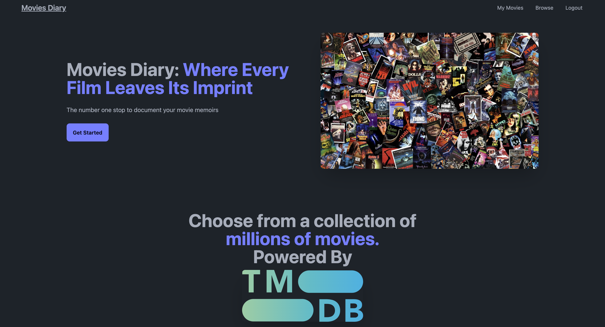
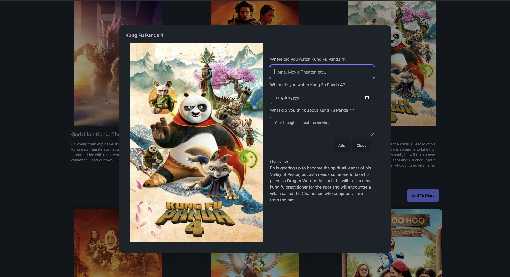

# [Movies Diary](https://moviesdiary.xyz): The app to immortalize your movie thoughts.

Sometimes it's hard to keep track of your thoughts regarding all the movies you watch, especially when you're a cinephile that watches tens or hundreds of movies a year. Movies diary solves this issue by giving you the ability to privately store your impressions about movies watched and easily access them as needed.

### Choose from a list of millions of movies provided by [TMDB](https://www.themoviedb.org/?language=en-US).

### Choose A Movie And Record Your Memories.

### Access them in demand!

### Built With

- [![Golang][Golang]][Golang-url]
- [![HTMX][HTMX]][HTMX-url]
- [![Javascriot][Javascript]][Javascript-url]

### Start Now At: [moviesdiary.xyz](https://moviesdiary.xyz)

[Golang]: https://img.shields.io/badge/go-%2300ADD8.svg?style=for-the-badge&logo=go&logoColor=white
[Golang-url]: https://go.dev/
[HTMX]: https://img.shields.io/badge/-HTMX-000000?logo=htmx
[HTMX-url]: https://htmx.org/
[JavaScript]: https://img.shields.io/badge/javascript-%23323330.svg?style=for-the-badge&logo=javascript&logoColor=%23F7DF1E
[JavaScript-url]: https://www.javascript.com/
